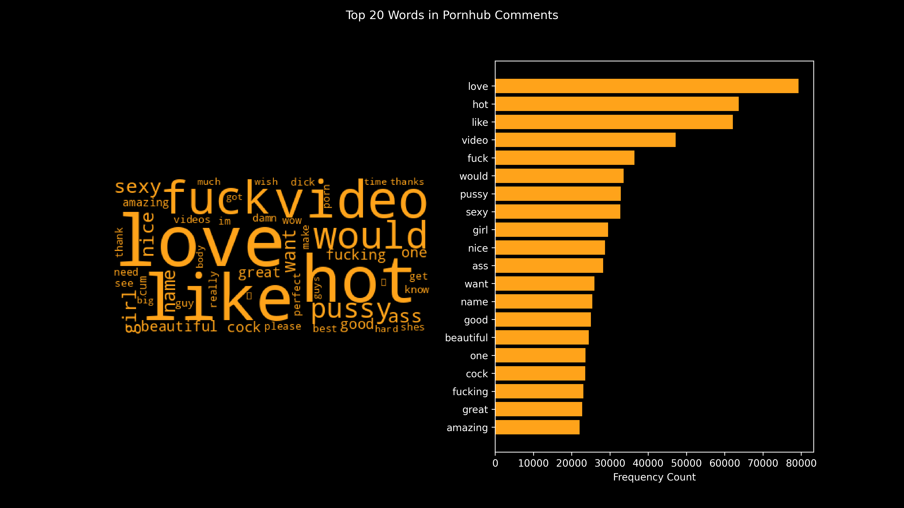
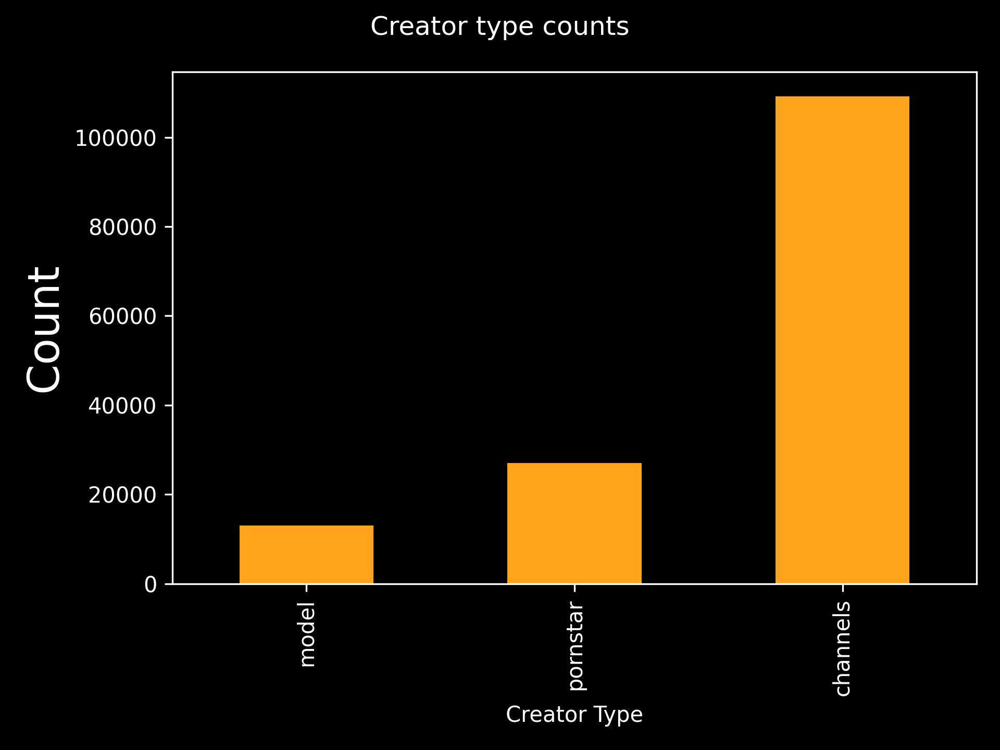
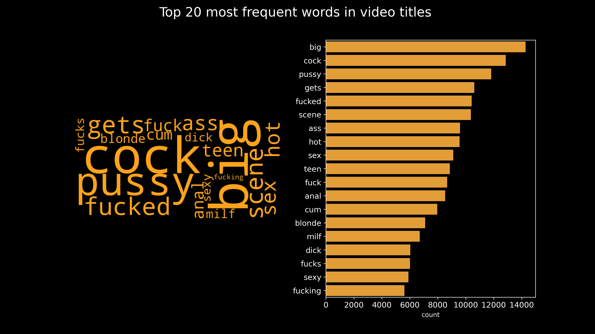
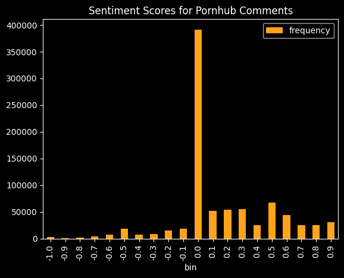
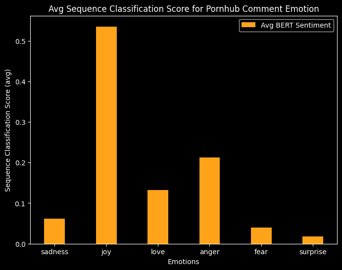
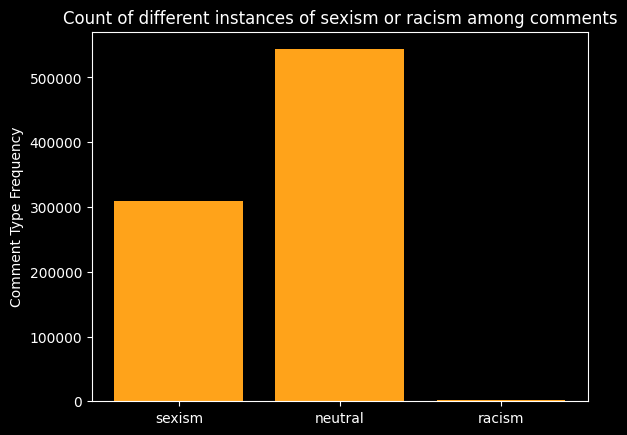
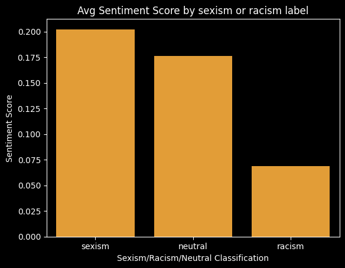

# Tracking Sexism in Pornhub Comments
## Pornhub Scholars: Kaya Borlase, Joseph Helbing, Loizos Bitsikokos
### MACS 30123
### Winter 2023

Who worked on what: 
- Scraper---Loizos Bitsikokos, Joseph Helbing 
- AWS Pipeline--- Joseph Helbing, Kaya Borlase
- Pyspark Analysis--- Loizos Bitsikokos, Kaya Borlase

## Introduction, Background and Significance

Pornography is a rather controversial topic with multiple sources attacking or defending it (Hald et al., 2014). In the digital age, there is a tremendous surplus of sexual content online (Pihlaja, 2016), while visibility of sex workers and sex worker rights is becoming increasingly relevant (Ham & Gerard, 2013; Verhoeven & van Gestel, 2016; Jones, 2022; Gilbert, 2023). The amount of online activity around sexual content has the potential to have real-world, particularly harmful implications, as the lives of sex workers could be exploited or endangered. Sex workers are a historically marginalized and vulnerable group (Guerta Pastori et al., 2022) that faces significant disadvantages in terms of health case access due to structural and policy barriers (Wanyenze et al., 2017), risks of sexual violence and police mistreatment (Zvi, 2021).

Online pornographic content has also severe implications for how content consumers perceive women (Cowan & Dunn, 1994). Sexual online content and the public discourse around it in platforms offering pornographic content is severely understudied (Phihlaja, 2016), while the only computationally significant studies of such content are conducted by the platforms themselves (see for example [Pornhub comments](https://www.pornhub.com/insights/pornhub-comments)).

This project explores perceptions of sex workers online by conducting a content analysis on comments scraped from Pornhub, a pornographic video-streaming website (see this [Wiki Article](https://en.wikipedia.org/wiki/Pornhub) for more information). 

We built a large-scale web-scraping and data pipeline on AWS that scraped comments from videos. We additionally conducted a data exploration and sentiment analysis to gain a general perception of the comment space. Finally, we trained sexism detector models to evaluate the amount of sexism prevalent in comments towards sex workers online. Overall, our research answers the following research questions: 

1. What is the public discourse in online pornography websites?
2. To what extent is there sexism in these media? Is the content positive? Negative? Or even nasty?

### Complimentary qualitative study 
Sex work may also have significant consequences for social life that often go unoticed. To showcase the hidden implications sex work can have in society, we conducted a short ethnographic study. We interviewed Greece's last model shoe maker, who constructs shoe models for both large-scale production and custom made shoes. With his business slowly fading away, he largely depends on custom shoe model orders by workers in the sex industry. The interview can be found [here](https://youtu.be/kgSEouqwGbw)

## Data, Methods and Scalability
As previously stated, we scraped the top comments under videos posted to the online pornography site, PornHub. We gathered a total of $839,537$ comments, from $149,431$ videos posted by $2,493$ creators. After cleaning the comments by removing stop words, we proceeded to the analysis. 

Overall, because we have a fairly large dataset of text data, it made sense to use scalable computing at each phase of the project. In addition, since the website's content is expected to aggregate over time, it is important to have a working large-scale pipeline that scrapes content asynchronously and stores data on the cloud. Completing our analysis in a scalable way, enables us to continue studying these online spaces over time and enrich the literature even further.

To create a random selection of video comments to scrape, we made use of Pornhub's random video call feature, which surfaces a random video from the Pornhub library. The Pornhub website makes extensive use of Javascript, and so a maximum of 10 of the most popular (most upvoted) comments are available per video. Future research could make use of more advanced webscrapping libraries (such as [Selenium](https://selenium-python.readthedocs.io/#)) to further enrich our data. An explanation and justification of each method is presented below in their respective sections.

## Structure of Processes

To collect the data, we implemented a parallelized scraper using a lambda function via AWS. Because we wanted to scrape comments from a large number of videos, it was necessary to parallelize the scraping process. Additionally, our lambda function wrote the comments directly into an [Amazon RDS](https://aws.amazon.com/rds/) so we did not have to worry about a memory bottleneck if we transfered the data back to our local machine. As the lambda function used unincluded packages, a zip file with the required packages is stored and updated within an S3 bucket to pass the zip file to the lambda function. To run a large set of lambda functions, an SQS Queue with a lambda trigger was created.

## Environment Creation

Assuming the user has updated their AWS credentials, a script to create the required environment to run all actions for the study can be run via the [from_the_top.sh](from_the_top.sh) shell script. If the user does not have the micromamba package manager, the shell script can download and install micromamba via the --mamba flag otherwise the script will use the users existing micromamba installation.
```
bash from_the_top.sh --mamba
```

The script creates a virtual environment from the `environment.yml` file, creates the AWS relational database and S3 bucket, uploads the lambda zip file, creates the SQS Queue and lambda trigger, updates the lambda function from the S3 hosted zip and sends a number of lambda instantiations to the SQS Queue with the number of pages to scrape per lambda function.

## Data Collection

 Overall, our scraper runs via the following steps:

1. The database and S3 bucket were initialized in [create_database.py](create_database.py) and the information for the RDB and S3 bucket are saved in the configuration file `db_details.ini` via the CLI command
```
python create_database.py --create
```
2. The file `scrape.py` reads out the configuration information in `db_details.ini` and creates the SQS Queue and Lambda triggers, unzips the `lambda_deployment.zip` file, inserts the updated `lambda_function.py`, rezips the file and uploads it to the S3 bucket, then tells lambda to update or create the lambda function via the --update flag. The number of lambdas is controlled via -l flag and the number of pages per lambda is controlled via the -n flag.
```
python scrape.py --update -l 1000 -n 20
```

This scraper allowed us to scrape and store a large number of comments that we likely wouldn't have been able to scrape in a reasonable time frame on our local machines. We recognize that the more comments we have, the more likely it is that we have a dataset that accurately represents the comment section of pornhub videos.

An initial problem we encountered was maxing out the number of connections available in the MySQL relational database which caused connection errors (see [Constraints for Amazon RDS](https://docs.aws.amazon.com/AmazonRDS/latest/UserGuide/CHAP_Limits.html)). We were able to fix this issue by limiting the number of concurrent lambda functions in `scrape.py` to 20 and increasing the RDB to a T3.medium instance with 4GB of RAM which allowed us to increase the maximum connections from 306 to 600. Note that it is advised to use fewer than the maximum allowed db connections ($100,000$ in the case of MYSQL db) to avoid out-of-memory issues.

To see the maximum number of db connections you can run the following SQL scripts:
```sql
SHOW GLOBAL VARIABLES LIKE 'max_connections';
```

```sql
SHOW GLOBAL status WHERE Variable_name LIKE 'Max_used_connections';
```

$12,000$ lambda functions pushed to the SQS Queue with a maximum concurrent lambda limit of 20 takes around 14 hours to complete a full run pulling roughly $900,000$ comments, though this number will vary because of the call to Pornhub's random video call, which surfaces a random video from the Pornhub library.

When scraping is finished, the full database schema can be downloaded as set of 3 `.parquet` files via
```
python create_database.py --download
```
and the RDB can be closed via

```
python create_database.py --close
```

Code for creating the db and scrping can be found in the [create_datapase.py](create_database.py) and [scrape.py](scrape.py) python scripts.

## Data Exploration

In order to explore the data, we use Pyspark to visualize different aspects of the text data. Because Pyspark uses a [lazy evaluation model](https://data-flair.training/blogs/apache-spark-lazy-evaluation/), it can be more efficient for working with large datasets. This is ideal for data visualizations that we present in the results section below. We ran the following data exploration:
1. Our upvote exploration involved using Pysparks groupby and count function to show the amount of times a video got a certain number of upvotes. We also computed the mean number of upvotes.
2. We additionally used Pyspark's map-reduce-by-key to find the most frequent words used in the PornHub Comments. This distributed the counting process across workers so our code was able to run more efficiently.

We also conduct exploratory analysis usin pyspark on the video table to analyze the words present in video titles, as well as see the proportions of different types of creators in our dataset (models, pornstars, channels).

Code for our Data Exploration can be found in the [01_data_exploration.ipynb](data_pipeline/01_data_exploration.ipynb) and [01a_data_exploration_videos_creators.ipynb](data_pipeline/01a_data_exploration_videos_creators.ipynb) jupyter notebooks.

## Sentiment Classification Model

Our Sentiment Classifier allowed us to understand some of the emotion behind the way that people comment on content from sex workers. PySpark allows for a distributed computing framework which allows us to perform the Sentiment Analysis tasks much more efficiently for our dataset. The Sentiment Analysis task was implemented in the following steps:
1. Our simple sentiment classifier ran using Pyspark's TextBlob and Sentiment functions. The sentiment score was given on a scale from -1 to 1, with -1 being the most negative and 1 being the most positive. The code for this sentiment classification can be found in [02_sentiment_scores.ipynb](data_pipeline/02_sentiment_scores.ipynb) jupyter notebook.
2. The BERT Sentiment classifier calculated a love, joy, surprise, sadness, and anger score for each PornHub comments. While this does not specifically run on pyspark, we do run a large-scale Transformer model, which is the BERT model. We believe that in the future, this code could be parallelized, especially when predicting sentiment in each of the comments (i.e. dividing comments between workers and having each worker take the model and predict sentiment for its selected comments). This code specifically trained the model on the "emotions" dataset found within Python's datasets package. Code for the BERT sentiment analysis can be found in the [02b_BERT_sentiment_transformer.ipynb](data_pipeline/02b_BERT_sentiment_transformer) jupyter notebook.

## Sexism Classifier

We explored the sexism present against female sex workers online by running a Sexism classifier on Pyspark. Pyspark's high computation power was well suited for our model which used text data as input for our classification model. Our Sexism classifier runs the following steps:
1. Pull from the 'cyberbullying' model found in Spark's NLP classification library to create an NLP Pipeline.
2. After preparing the data, run our text data through the NLP Pipeline to label each comment as being sexist, neutral, or racist. Using a SparkNLP model ensures the workload is distributed and makes our classification code efficient.

Code for the sexism classification model can be found in [03_sexism.ipynb](data_pipeline/03_sexism.ipynb)

### Results and Discussion

Overall, we found quite a large number of comments were sexist. We additionally got quite positive sentiment analysis results, but there could be errors in our models. In particular, these language models were not trained specifically on text content that was sexually explicit in nature. Therefore, we believe that the sentiment analysis results and the sexism classification results might be skewed. Overall, we feel we are underestimating the amount of sexism in the comments and overestimating the positive sentiment in the comments.

A subset of comments by classifier is available at the link [CONTENT WARNING](#content-warning)


#### Data Exploration

Regarding the number of upvotes, we found that overall the average number of upvotes was around 8 upvotes. For the number of people using Pornhub, this number was lower than we were expecting. However, considering the design of the platform and the fact that people are largely using Pornhub to watch videos and not interact with other consumers, it makes sense that the number of upvotes would be small.

Our word frequency analysis results are below in both a WordCloud with the Top 50 most frequent words and a bar chart with the Top 20 most frequenct words. We were surprised to see that "love" was the top word in the PornHub Comments. This is likely the case because consumers are saying they "love" an aspect of the video, or especially love some part of the sex worker - the sex worker(s) themselves, a part of their body, etc.. 



In addition, through counting the number of videos posted by different types of creators, we see that the vast majority of videos in our dataset concerns channels ($109,182$ videos), while independent models are a minority ($13,024$ videos). This could mean that porn as an "industry" might be driving online sexual content.



Furthermore, we produced a word freqeuncy plot for the video titles for the top 20 most frequent words in both a bar chart and wordcloud format. The content analysis of video titles, reveals some alarming results as for example the word "teen" is found to be the 10th most common word in video titles.




#### Sentiment Analysis

We found that, in general, while there are a lot of neutral comments, the comments skew to the positive side, per the chart below.



Additionally, when we broke down the Sentiment Analysis into separate emotions, we found that most of the comments were classified as having the highest level of "joy" out of the emotions. The second most prevalent emotion was "anger". Overall, we believe that this dichotomy could be capturing the sort of aggressive praise that many sex workers get from the content consumers, and that we are not actually seeing actual joy expressed in the comments, in a way "joy" might be typically described.



#### Sexism Classification Model

Finally, our sexism classification model classified quite a few comments as sexist, per the chart below. In a quick perusal of these classifications, though, we noticed that the model was failing to classify comments as sexist despite clearly targeted words being used. This is likely because the model was unable to pick up on slang terms and had to take the comments at face value. For example, a comment about a "bush" was not describing a hedge found outside, but the model was not able to pick up on this and failed to flag these types of comments. For that reason, we believe we are underestimating sexism because the sexism classification model was not trained for this specific content. We also found that relatively few comments were flagged as being racist. Of those that were, we noticed that any comments that mentioned praying were flagged as racist even if they didn't mention race. Therefore, we believe that the racism classification part of the model is flawed as well.



When we looked at the average sentiment score for different classifications of comments, we found that the most positive category of comments was the sexist category. This was unexpected, and likely points to an error in using a model that was not trained on this specific type of text data. That being said, there is an interesting trend of comments using positive words when discussing the sex workers body or their work in the video, which is interesting in the space as well.




### Conclusion

Overall, both the sentiment and sexism classifier point to important social implications of these comments. If comments are more positive towards certain types of sex workers, it is likely to perpetuate stereotypes about what is desireable, which in turn can create unrealistic expectations for people in real life. Additionally, if the comments are sexist or racist, they perpetuate prejudiced views against women and people of color which can be harmful especially in intimate circumstances when people are vulnerable. Overall, large scale methods allowed us to examine a broad scope of the PornHub digital space and allowed us to analyze them efficiently, although perhaps not completely accurately. That being said, we were able to gain a baseline understanding of the nature of comments on the Pornhub website.

### Future Implications and Limitations

As previously stated, our analysis allowed us to gain an understanding of the nature of comments on the Pornhub website. That being said, there are ways that our analysis could be improved.

First, while we classified the comments on sexism and racism (with a focus on sexism), it is likely that the comments also have other forms of discrimination present, such as homophobia. With that in mind, it would be important in future analyses to include some sort of homophobia, or other, classifiers to account for more harm perpetuation in the online discourse.

Second, we do not break down the PornHub videos by category of porn or by who is viewing the videos. In this way, because we are randomly selecting videos, we might be noticing trends that are actually driven by just a subset of PornHub videos. Note that the video titles content analysis reveals that the words "tenn" and "MILF" are prevalent in our dataset. This might mean that our analysis is driven by specific categories of porn. In the future, a scraper which somehow finds video tags might be helpful for a more complete analysis. 

Third, it is possible, as with any other online platform, that some of the comments that we scraped were left by bots and not by people. Bots are used to drive video engagement, because they can create traffic (see this [forum]((https://hackforums.net/showthread.php?tid=5990040)) where someone is selling PornHub Bots to drive traffic to videos. It seems like most of our comments have valid text data, so we believe this is not skewing our results much.

Finally, $800,000$ comments just begins to scratch the surface of the complete space of Pornhub comments. Future analyses should attempt to scrape many more comments to evaluate whether our subset was fully representative of the whole space.

Overall, because research in this space is limited, the analysis could be improved and built upon in the future, as the field studying online discourse around sex work expands and develops.

### References
- Cowan, G., & Dunn, K. F. (1994). What themes in pornography lead to perceptions of the degradation of women? Journal of Sex Research, 31(1), 11–21. https://doi.org/10.1080/00224499409551726
- Gilbert, E. (2023). Beyond the usual suspects: Invisible labour(ers) in futures of work. Geography Compass. https://doi.org/10.1111/gec3.12675
- Guerta Pastori, B., Biliato Colmanetti, A., & de Azevedo Aguiar, C. (2022). Percepções de profissionais do sexo sobre o cuidado recebido no contexto assistencial à saúde. Journal of Human Growth and Development, 32(2), 275–282. https://doi.org/10.36311/jhgd.v32.10856
- Ham, J., & Gerard, A. (2013). Strategic in/visibility: Does agency make sex workers invisible? Criminology & Criminal Justice, 14(3), 298–313. https://doi.org/10.1177/1748895813500154
- Jones, A. (2022). “People need to know we exist!”: an exploratory study of the labour experiences of transmasculine and non-binary sex workers and implications for harm reduction. Culture, Health & Sexuality, 1–15. https://doi.org/10.1080/13691058.2021.2018500
- Pihlaja, S. (2016). Expressing pleasure and avoiding engagement in online adult video comment sections. Journal of Language and Sexuality, 5(1), 94–112. https://doi.org/10.1075/jls.5.1.04pih
- Verhoeven, M., & van Gestel, B. (2016). Between Visibility and Invisibility: Sex Workers and Informal Services in Amsterdam. Feminist Economics, 23(3), 110–133. https://doi.org/10.1080/13545701.2016.1195002
- Wanyenze, Rhoda K., et al. ““When They Know That You Are a Sex Worker, You Will Be the Last Person to Be Treated”: Perceptions and Experiences of Female Sex Workers in Accessing HIV Services in Uganda.” BMC International Health and Human Rights, vol. 17, no. 1, 5 May 2017, bmcinthealthhumrights.biomedcentral.com/articles/10.1186/s12914-017-0119-1, https://doi.org/10.1186/s12914-017-0119-1.
- Zvi, L. (2021). Police Perceptions of Sex-worker Rape Victims and Their Offenders: a Vignette Study. Journal of Interpersonal Violence, 37(15-16), 088626052110051. https://doi.org/10.1177/08862605211005140
‌
<br>
<br>
<br>
<br>
<br>
<br>
<br>
<br>
<br>
<br>
<br>
<br>
<br>
<br>
<br>
<br>
<br>
<br>
<br>
<br>
<br>
<br>
<br>
<br>
<br>
<br>
<br>
<br>
<br>
<br>
<br>
<br>
<br>
<br>
<br>
<br>
<br>
<br>
<br>
<br>


# CONTENT WARNING
### 10 random comments with positive sentiment score and categorized as sexist:
|        | comment_text                                                                                                                             |
|-------:|:-----------------------------------------------------------------------------------------------------------------------------------------|
| 154163 | Damn, I would have loved to try and lick all that sweet cream oozing from your pussy and lick that clenching asshole free of your grool! |
| 261216 | Sometimes you just have to put her hand behind her head to help her take all the cock 🙂                                                 |
| 428049 | Cum down her throat. Big throatpie.                                                                                                      |
| 506018 | Great video 😉                                                                                                                           |
| 700660 | Because they are step bro and step sis                                                                                                   |
| 442476 | Anyone here from dank memes gang?                                                                                                        |
| 832234 | Mmmmhmmm id love to help!                                                                                                                |
| 368780 | An accident waiting to happen. I was on the edge of my seat man                                                                          |
| 497496 | Who is this guy? Love how excited he gets                                                                                                |
| 112179 | My pussy is so wet :$                                                                                                                    |

### 10 random comments with negative sentiment score and categorized as sexist:
|        | comment_text                                                                                                                                                                                                                     |
|-------:|:---------------------------------------------------------------------------------------------------------------------------------------------------------------------------------------------------------------------------------|
| 693851 | beatiful sexy and hot 🙂 i like eat pussy and squirt 😉                                                                                                                                                                          |
| 798063 | Lucky boy !                                                                                                                                                                                                                      |
| 654424 | seeexy                                                                                                                                                                                                                           |
| 483574 | She really doesn't. Seeing as you're the only commenter who thinks that I think it's safe to say you're just wrong. Also congratulations on being a prick. Even if you were right (you're not) it's just an unnecessary comment. |
| 512000 | so sexy                                                                                                                                                                                                                          |
| 638913 | That purple panties turn me on                                                                                                                                                                                                   |
| 474671 | thanks                                                                                                                                                                                                                           |
| 129477 | Waste of an ending. He should of pulled out and have her jack him all over her beautiful milky belly! WTF!                                                                                                                       |
| 450341 | leave the converse on next time, they are super hot!                                                                                                                                                                             |
| 641509 | Names???                                                                                                                                                                                                                         |

### 10 random positive comments that are neutral:
|        | comment_text                                                                                                                                                                                                                                                                               |
|-------:|:-------------------------------------------------------------------------------------------------------------------------------------------------------------------------------------------------------------------------------------------------------------------------------------------|
| 129905 | Those tits...                                                                                                                                                                                                                                                                              |
| 601318 | Crazy fucking bitch                                                                                                                                                                                                                                                                        |
|  42944 | The piss my boner...piss is so gross....                                                                                                                                                                                                                                                   |
| 302740 | He's fucking hilarious!                                                                                                                                                                                                                                                                    |
| 431634 | How does a couple apply or get on film?                                                                                                                                                                                                                                                    |
| 497684 | Damn that's my dream girl leg twitches and all                                                                                                                                                                                                                                             |
| 169139 | So fire ❤I’m from NJ let’s work 🤪                                                                                                                                                                                                                                                         |
| 703488 | By far my favorite girl on PH! My wife wants to do this very thing and I'm ALL for it. I can't wait. LOVE LOVE watching these guys cum in you, especially one right after the other. Double vag is on the top of our list and would LOVE to see you do this as well. Please and thank you! |
|  89736 | Go for it man. Love from Sweden. Per                                                                                                                                                                                                                                                       |
| 208283 | Is it weird if I spent the last 420 years 360 no scoping my cum only to Sophie Dee                                                                                                                                                                                                         |

### 10 random negative comments that are neutral:
|        | comment_text                                                                                                                                                                                                       |
|-------:|:-------------------------------------------------------------------------------------------------------------------------------------------------------------------------------------------------------------------|
| 437981 | Wow you really suck.                                                                                                                                                                                               |
|        | Not in a bad way btw.                                                                                                                                                                                              |
|  97534 | My gosh this is amazing and adorable! Just look at that fluffy butt ♡                                                                                                                                              |
| 310853 | Nice hot lesbian fuck. I'm soaking 💦                                                                                                                                                                              |
|   1499 | fr ? damn                                                                                                                                                                                                          |
| 116691 | Seeing this guys dick made me depressed.                                                                                                                                                                           |
| 503660 | Exactly what i thought when he started flexing tbh                                                                                                                                                                 |
| 578787 | Wow, nice ride. One of the best on PH 🙂 would like to see your tits bouncing, too ;-)                                                                                                                             |
|  92049 | I am absolutely in love with this woman and have been watching her creampie videos for a while now. Nothing in life do I wish for more than a woman who loves multiple hung men erupting balls deep into her pussy |
| 656031 | You got daddy issues my friend?                                                                                                                                                                                    |
| 196096 | yeah, what happened?                                                                                                                                                                                               |
